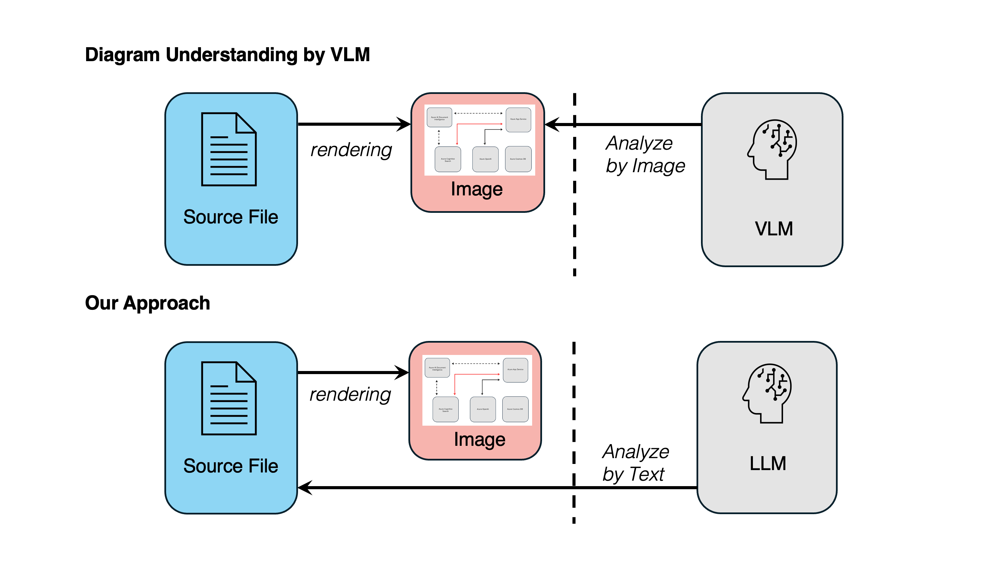

<!-- markdownlint-disable first-line-h1 -->
<!-- markdownlint-disable html -->
<!-- markdownlint-disable no-duplicate-header -->

<div align="center">
  
</div>
<hr>


# 🔭 Overcoming Vision Language Model Challenges in Diagram Understanding: A Proof-of-Concept with XML-Driven Large Language Models Solutions


[](https://opensource.org/licenses/Apache-2.0)
[](https://arxiv.org/html/2502.04389v1)

## 🔍 Project Overview




Traditional Vision-Language Models (VLMs) struggle to accurately interpret diagram structures in business documents. This project enables precise extraction and analysis of a system architecture diagram by directly retrieving structured metadata (shapes, lines, annotations) from editable source files, XML files of Excel (.xlsx). By converting this metadata into text for Large Language Models (LLMs), our approach eliminates the inaccuracies of image-based processing, allowing for more reliable business question answering and diagram comprehension.

## 🔗 Related Repository: 🔭📊 Spreadsheet Intelligence
[](https://pypi.org/project/your-package-name/)
[](https://github.com/galirage/spreadsheet-intelligence)
[](https://galirage.github.io/spreadsheet-intelligence/)


In this project, we developed a Python package for extracting and analyzing metadata from Excel files for experimental purposes. The package has been released on PyPI.


## 🌟 Highlights
- **`2025-02-05`** Codes are now released🧑‍💻!
- **`2025-02-05`** Our paper is available on [Arxiv](https://arxiv.org/html/2502.04389v1)📄!


## 🚀 Getting Started
### 1. Requirements 📦

For an optimal experience, we recommend using pipenv to set up a new environment for this project.

```bash
pipenv install
```

### 2. Configuration ⚙️ 

Please set up your OpenAI API keys.
Copy `.env.sample` to `.env` and set your API keys.

### 3. Running Experiment 🧑‍💻

Running experiment script of our approach is straightforward:
```bash
pipenv run python src/main.py --w_xml
```
And you can also run the experiment with VLM-based approach (baseline comparison) with the following command:
```bash
pipenv run python src/main.py --w_img
```


## 🔖 Citation
If you find our paper and codes useful, please kindly cite us via:

```bibtex
@article{shiinoki2025overcoming,
  title={Overcoming Vision Language Model Challenges in Diagram Understanding: A Proof-of-Concept with XML-Driven Large Language Models Solutions},
  author={Shiinoki, Shue and Koshihara, Ryo and Motegi, Hayato and Morishige, Masumi},
  journal={arXiv preprint arXiv:2502.04389v1},
  year={2025}
}
```

## 📝 License
This project is released under the Apache 2.0 license.
